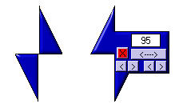



## Calipers3\.0\(Updated Again 5\-17\-04\)

### Description

I think I have finally got it working the way I wanted. Use it to measure pixels on screen or in projects.Hope you like it.
 
### More Info
 

             |
---                |---
**Submitted On**   |2004-05-18 16:54:12
**By**             |[Kenneth Foster](https://github.com/Planet-Source-Code/PSCIndex/blob/master/ByAuthor/kenneth-foster.md)
**Level**          |Beginner
**User Rating**    |4.9 (69 globes from 14 users)
**Compatibility**  |VB 6\.0
**Category**       |[Miscellaneous](https://github.com/Planet-Source-Code/PSCIndex/blob/master/ByCategory/miscellaneous__1-1.md)
**World**          |[Visual Basic](https://github.com/Planet-Source-Code/PSCIndex/blob/master/ByWorld/visual-basic.md)
**Archive File**   |[Calipers3\_1747255182004\.zip](https://github.com/Planet-Source-Code/kenneth-foster-calipers3-0-updated-again-5-17-04__1-53768/archive/master.zip)

